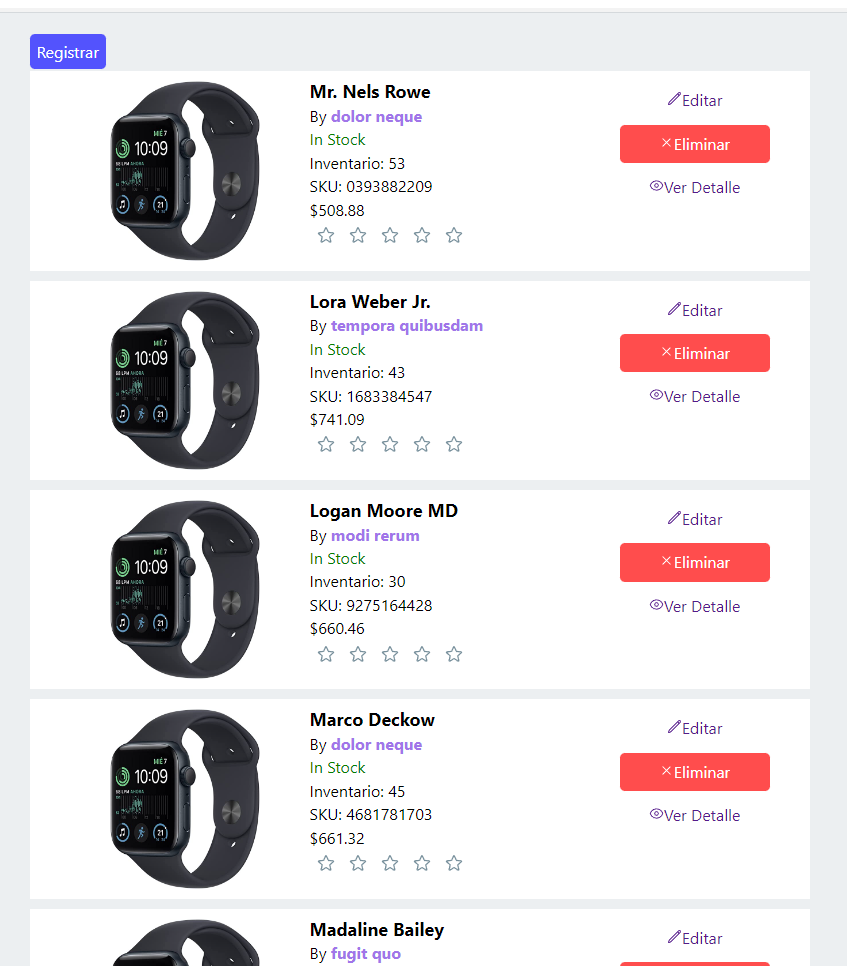

# PRUEBA TECNICA DE INVENTARIOS 📝

Objetivo:

Crear un inventario de productos con laravel y vuejs, arquitectura de base de datos propuesta 
por el postulante de acuerdo a los siguientes requerimientos.
1. Crear un nuevo proyecto en Laravel con el nombre de Inventario.
2. Generar la migración para la tabla de productos utilizando los siguientes campos: id, 
sku, nombre, id de categoría, descripción, precio, cantidad, estado (con inventario o sin 
inventario), crear modelo, controlador y rutas (api restful).
3. Generar la migración para la tabla de categorías de productos y crear una relación de 
N:N con la tabla de productos.
4. Crear factory y seeder para crear 200 productos de prueba con evaluaciones de ejemplo 
y categorías.
5. *Llenar la base de datos con registros de prueba para poder continuar con el ejercicio.
6. Crear formulario de alta de producto
7. Crear un listado de todos los productos registrados con las columnas de sku, nombre de 
producto, categorías, inventario, calificación, agregar botón para agregar un nuevo 
producto, además, el listado debe contener una columna con acciones de ver detalle, 
editar, con inventario o sin inventario y eliminar.
8. Vista de detalle de producto.
9. Crear funcionalidad para calificar productos de 1 a 5 estrellas (Un producto puede tener 
varias calificaciones)
10. Funcionalidad para marcar un producto como sin inventario
11. Realizar eliminación lógica

- La Carpeta Inventario es un proyecto API REST echo con Laravel 10
- La Carpeta frontend es la interfaz creada con Reactjs usando vitejs
- La Carpeta Postman contiene las pruebas realizadas al API por medio de postman

 
 ## Dentro de la carpeta inventario
 - para installar paquetes
 - ejecutar las migraciones y los seeder
 - correr el servidor
~~~laravel  
  composer install
  php artisan migrate --seed
  php artisan serve
~~~  

## Dentro de la carpeta fronten Ejecutar 
~~~javascript  
  npm run install 
  npm run dev 
~~~  

## Screenshots  
  
